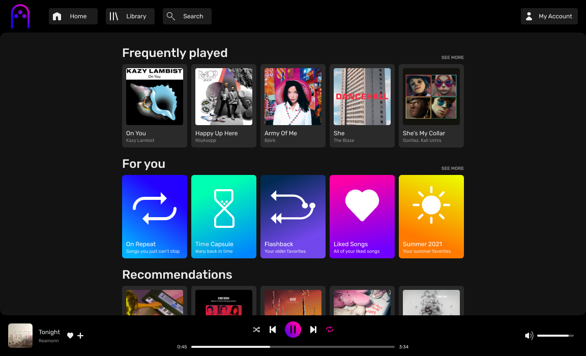

# juukebox
Juukebox is Spotify-like music streaming service SPA clone. It's written in Typescript and it uses Tailwind CSS for styling. The components are made from scratch and no UI component library is used. All icons are designed by me from scratch in Figma. It is still work in progress.

